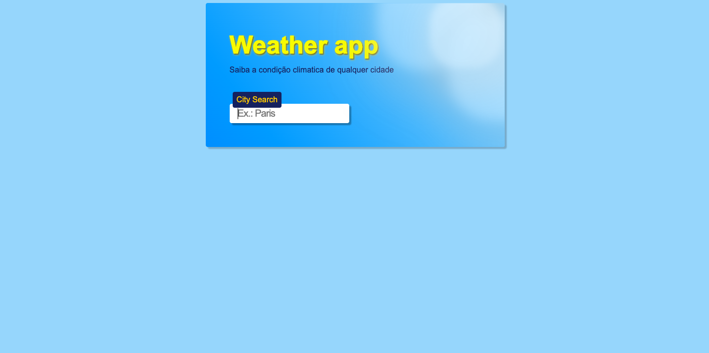

# Weather App 🌦️

Bem-vindo ao Weather App, sua ferramenta confiável para obter informações climáticas instantâneas de qualquer cidade!

## Sobre o Projeto

O Weather App é uma aplicação simples, mas poderosa, que permite aos usuários obterem a condição climática atual de qualquer cidade ao redor do mundo. Desenvolvido por [Yuri Galvão](https://github.com/gvao), este projeto é uma demonstração do uso de tecnologias como HTML, CSS, e JavaScript.

## Como Funciona

1. Digite o nome da cidade na barra de pesquisa.
2. Receba instantaneamente informações precisas sobre a condição climática da cidade.
3. Maravilhe-se com a simplicidade e eficácia do Weather App!

## Capturas de Tela

    
    

## Como Utilizar

1. Clone este repositório.
2. Abra o arquivo `index.html` em seu navegador favorito.
3. Digite o nome da cidade na barra de pesquisa e obtenha a previsão do tempo.

## Tecnologias Utilizadas

- HTML
- CSS
- JavaScript

## Como Contribuir

Se você deseja contribuir para o desenvolvimento do Weather App, siga estas etapas:

1. Fork este repositório.
2. Crie uma branch com sua feature: `git checkout -b minha-feature`.
3. Faça commit das suas mudanças: `git commit -m 'Adiciona minha feature'`.
4. Faça push para a branch: `git push origin minha-feature`.
5. Abra um pull request.

## Contato

- Email: [yuri.gvao@gmail.com](mailto:yuri.gvao@gmail.com)
- instagram: [@yuri.gvao](https://www.instagram.com/yuri.gvao)
- LinkedIn: [Yuri Galvão](https://www.linkedin.com/in/yuri-galvao/)
